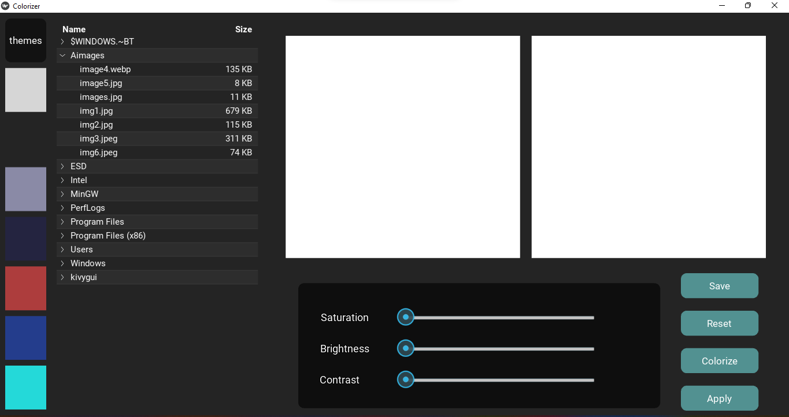
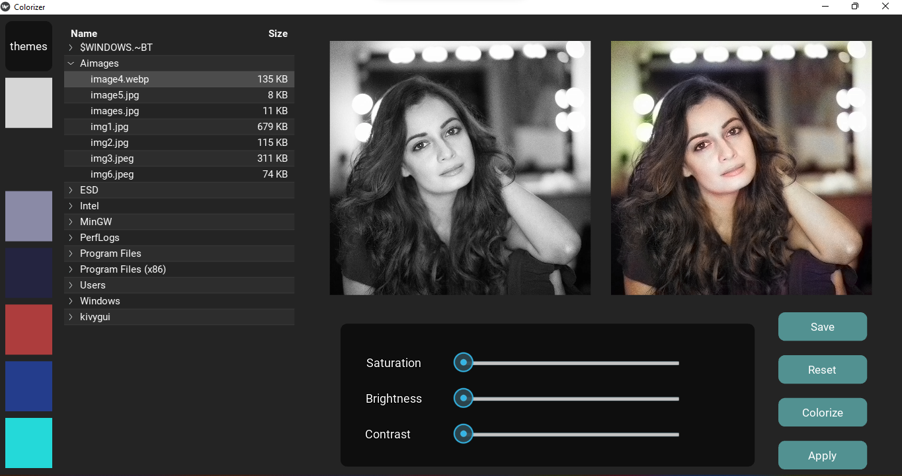
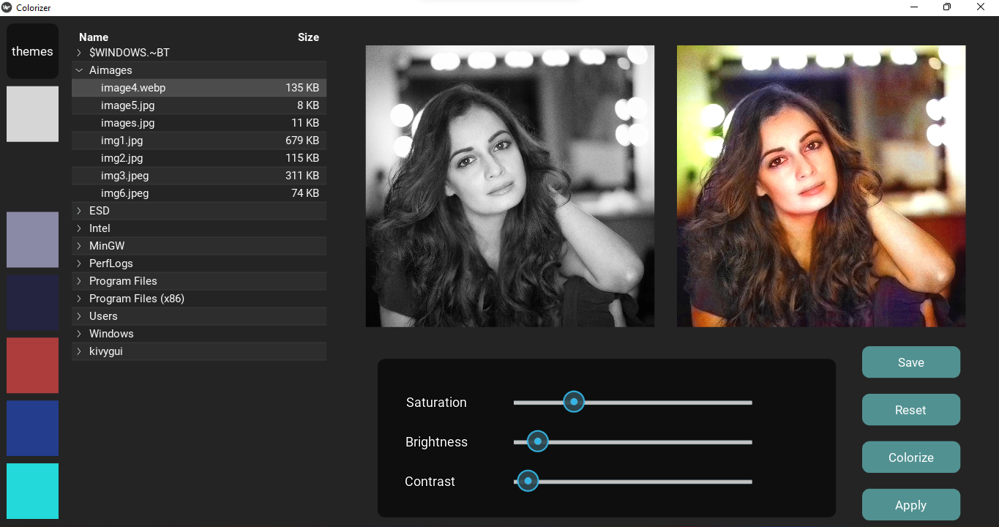
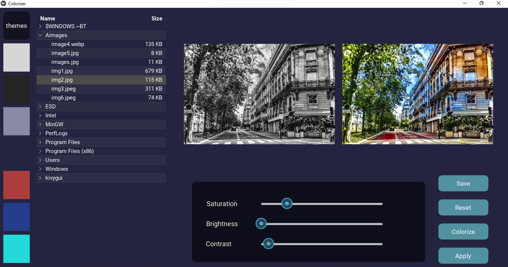

# Image_Colorizer
This is a python project which colors black and white images

#Requirements:

  To get the program running you need ***kivy*** and ***opencv*** module and python( version 3.9 and above). 
  
  You also need to download modle and past in the ***modles folder*** ( see readme file in modles folder)
  and paste all the files in the same folder and enjoy.

#Working:

